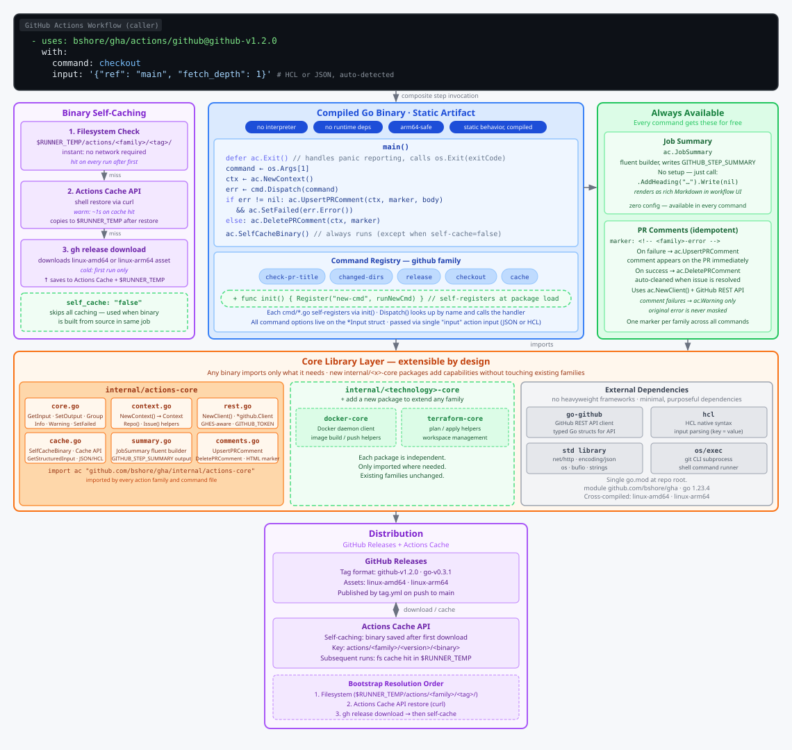

# gha

A Go-based framework for writing GitHub Actions. Replaces bash/Python/JavaScript action steps with compiled Go binaries for better performance and lower-level control. Actions are organized into "families", each compiled to a standalone binary and distributed via GitHub Releases.

## Action Families

| Family | Description |
|--------|-------------|
| [`github`](actions/github/README.md) | GitHub-specific commands: PR title validation, changed-dirs detection, releases, checkout |
| [`go`](actions/go/README.md) | Go toolchain commands: build, setup, cache |
| [`yoink`](actions/yoink/README.md) | Minimal Docker action that captures Actions cache service env vars for composite steps |

## High-level Overview

Actions are grouped into "families" of the technology they interact with (actions/go, actions/github, etc).

Each action family contains a single `action.yml` file invoking a `bootstrap.sh` script.

The script prepares the go binary, and executes it with the command from the action's input as an argument.

## TODOS:

Integrate with GitHub GraphQL API when (if) needed. This would be super useful, especially if the TF Provider used it (ex: can commit [multiple files at once](https://docs.github.com/en/graphql/reference/mutations#createcommitonbranch)). No official Go client library yet, community library is [shurcooL/githubv4](https://github.com/shurcooL/githubv4)

- Docker
- Python
- AWS
- Terraform
- 1Password
- ...
